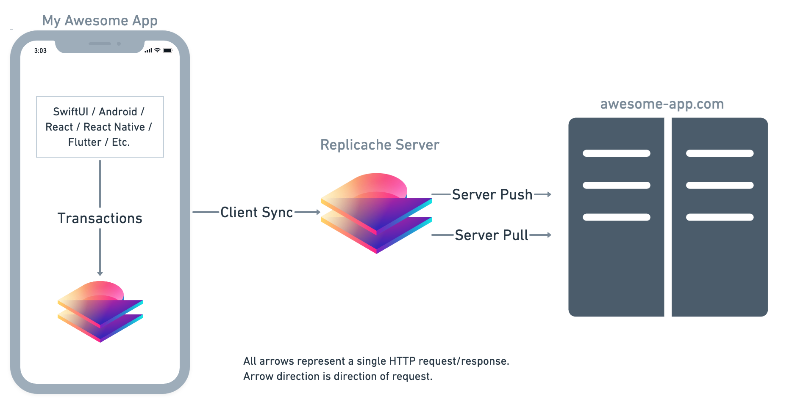

# Table of Contents

* [Spinner-Free Applications](#spinner-free-applications)
* [Introducing Replicache](#introducing-replicache)
* [System Overview](#system-overview)
  * [Transaction IDs](#transaction-ids)
  * [Checksums](#checksums)
  * [Replicache Client](#replicache-client)
  * [Replicache Server](#replicache-service)
  * [Customer Server](#customer-service)
* [Synchronization](#synchronization)
  * [Server Pull](#server-pull)
  * [Client Pull](#client-pull)
  * [Client Push](#client-push)
  * [Server Push](#server-push)
  * [Pokes](#pokes)
* [Conflict Resolution](#conflict-resolution)
* [Images and other BLOBs](#images-and-other-blobs)

# Spinner-Free Applications

"[Offline-First](https://www.google.com/search?q=offline+first)" describes a client/server architecture where
the application reads and writes to a local database on the device, and synchronizes with servers asynchronously whenever
there is connectivity.

These applications are highly desired by product teams and users because they are so much more responsive and
reliable than applications that are directly dependent upon servers. By using a local database as a buffer, offline-first
applications are instantaneously responsive and reliable in any network conditions.

Unfortunately, offline-first applications are also really hard to build. Bidirectional
sync is a famously difficult problem, and one which has elluded satisfying general
solutions. Existing attempts to build general solutions (Apple CloudKit, Android Sync, Google Cloud Firestore, Realm, PouchDB) all have one or more of the following serious problems:

* **Non-Convergence.** Many solutions do not guarantee that clients end up with a view of the state that is consistent with the server. It is up to developers to carefully construct a patch to send to clients that will bring them into the correct state. Client divergence is common and difficult to detect or fix.
* **Manual Conflict Resolution.** Consult the [Android Sync](http://www.androiddocs.com/training/cloudsave/conflict-res.html) or [PouchDB](https://pouchdb.com/guides/conflicts.html) docs for a taste of how difficult this is for even simple cases. Every single pair of operations in the application must be considered for conflicts, and the resulting conflict resolution code needs to be kept up to date as the application evolves. Developers are also responsible for ensuring the resulting merge is equivalent on all devices, otherwise the application ends up [split-brained](https://en.wikipedia.org/wiki/Split-brain_(computing)).
* **No Atomic Transactions.** Some solutions claim automatic conflict resolution, but lack atomic transactions. Without transactions, automatic merge means that any two sequences of writes might interleave. This is analogous to multithreaded programming without locks.
* **Difficult Integration with Existing Applications.** Some solutions effectively require a full committment to a non-standard or proprietary backend database or system design, which is not tractable for existing systems, and risky even for new systems.

For these reasons, existing products are often not practical options for application developers, leaving them
forced to develop their own sync protocol at the application layer if they want an offline-first app. Given how expensive and risky this is, most applications delay offline-first until the business is very large and successful. Even then, many attempts fail.

# Introducing Replicache

Replicache dramatically reduces the difficulty of building offline-first applications.

The key features that contribute to Replicant's leap in usability are:

* **Guaranteed Convegence**: Replicache guarantees that after each sync, a client will exactly match the state of the server. Developers do not need to manually track changes or construct diffs.
* **Transactions**: Replicache models change in the system as full [ACID](https://en.wikipedia.org/wiki/ACID_(computer_science)) multikey read/write 
transactions. On the server, transactions are expected to be implemented as REST or GraphQL APIs. On the client, transactions in Replicache are expressed as arbitrary functions, which are executed serially and isolated from 
each other.
* **Much Easier Conflict-Resolution**: Replicant is a [Convergent Causal Consistent](https://jepsen.io/consistency/models/causal) system: after synchronization, transactions are guaranteed to have run in the same order on all nodes, resulting in the same database state. This feature, combined with transaction atomicity,
makes conflict resolution much easier. Conflicts do still happen, but in many cases resolution is a natural side-effect of serialized atomic transactions. In the remaining cases, reasoning about conflicts is made far simpler. These claims have been reviewed by independent Distributed Systems expert Kyle Kingsbury of Jepsen. See [Jepsen Summary](jepsen-summary.md) and [Jepsen Article](jepsen-article.pdf).
* **Standard Data Model**: The Replicant data model is a standard document database. From an API perspective, it's
very similar to Google Cloud Firestore, MongoDB, Couchbase, FaunaDB, and many others. You don't need to learn anything new, 
and can build arbitrarily complex data structures on this primitive that are still conflict-free.
* **Easy Integration**: Replicant is a simple primitive that runs along side any existing stack. Its only job is to provide bidirectional conflict-free sync between clients and servers. This makes it very easy to adopt: you can try it for just a small piece of functionality, or a small slice of users, while leaving the rest of your application the same.

# System Overview



## Data Model

Replicache is concerned with synchronizing updates to a user's *state*. The state is a set of key/value pairs. Keys are arbitrary byte strings, values are JSON.

## TransactionIDs

Updates in Replicache are transactional: multiple keys can be modified atomically. Transactions are identified by a _TransactionID_, which has two parts:

* A *Client ID*: A string generated by Replicache Server which uniquely identify clients.
* A *Transaction Ordinal*: An incrementing integer uniquely identifying each transaction originating on a particular client.

### TransactionID Serialization

TransactionIDs are serialized as a JSON array with two elements:

```
// client b4866c5a3b, ordinal 42
["b4866c5a3b", 42]
```

In cases where TransactionIDs need to be sent as strings, the JSON serialization is sent.

## Checksums

At various places in the Replicache protocol, checksums are used to verify two states are identical.

Replicache uses the [LtHash](https://engineering.fb.com/security/homomorphic-hashing/) algorithm to enable efficient incremental computation of checksums.

The serialization fed into the hash is as follows:

* The number of key/value pairs in the state, little-endian
* For each key/value pair in the state, in lexicographic order of key:
  * length of key in bytes, little-endian
  * key bytes
  * length of value when serialized as [CanonicalJSON](http://gibson042.github.io/canonicaljson-spec/) in bytes, little-endian
  * value as [CanonicalJSON](http://gibson042.github.io/canonicaljson-spec/)

## Replicache Client

The Replicache Client maintains:

* The current client ID
* A _bundle_ of JavaScript, provided by user code, containing _bundle functions_ which can be invoked to by user code to read or write data
* A versioned, transactional key/value store
  * Versioned meaning that we can go back to any previous version
  * Transactional meaning that we can read and write many keys atomically
  * It must also be possible to _fork_ from a historical state, apply many transactions, then commit those transactions atomically

Each version in the key/value store is a _commit_. There are two types of commits:
* *Snapshots* represent the current state received from server at some moment in time
* *Mutations* represent a change made on the client-side not yet known to be confirmed by server

Both transaction types contain:
* An immutable snapshot of the state
* The *TransactionID* of the transaction that created the state
* A *Checksum* over the state

Additionally, mutation commits contain:
* The name of a JavaScript function plus arguments that was used to create this change

## Replicache Server

Replicache Server is a multitenant distributed service, which maintains, for each connected client:

* A history of recent snapshots

Note: The history doesn't need to be complete. Missing history entries don't affect the correctness of the system, only sync performance.

For each snapshot:

* TransactionID
* Checksum
* State

## Customer Server

The Customer Server is a standard REST/GraphQL web service. In order to integrate with Replicache it has to maintain the following additional state:

* A table mapping ClientID->TransactionOrdinal

This table tracks the last applied transaction ordinal for every known client. This table grows with O(number of users) and cannot ever be pruned because it will stall sync of those users. The only recovery would be for those clients to give up and get new client ids.

# Synchronization

There are three continuous decoupled processes happening at all times. Any of these processes can stop or stall indefinitely without affecting correctness.

Data conceptually flows in unidirectional loop: from device to Replicache Server, to Customer Server, back to Replicache Server, back to device.

## Client Sync

The client invokes the `sync` API on the Replicache Server, passing any pending mutations and the last confirmed `TransactionID` it has, along with the corresponding `checksum`.

The Replicache Server applies the mutations (using `Server Push`), then obtains and stores a new snapshot (using `Server Pull`).

Replicache Server then validates the checksum of the last confirmed `TransactionID` passed by the client. If the commit is unknown or the checksum doesn't match, Replicache Server logs an error and returns the entire state. Otherwise, it computes and returns a [JSONPatch](http://jsonpatch.com/) that will bring the client into alignment with the latest server.

Client forks from basis `TransactionID`, applies the patch, checks the checksum, then re-runs any pending transactions to create final local state.

### Request

* `Basis`: The last confirmed transaction ID the client has, which any provided mutations are based on
* `Checksum`: The checksum client has for _basis_
* `Mutations`: Zero or more mutations to apply to customer server, each having:
  * `TransactionID`
  * `Path`: Path at customer server to invoke
  * `Payload`: Payload to supply in POST to customer server

### Response

* `TransactionID`: The ID of the last transaction applied on the server
* `Patch`: The patch to apply to client state to bring it to *TransactionID*
* `Checksum`: Expected checksum to get over patched data

## Server Push

Replicache Server applies mutations to Customer Server by invoking standard REST/GraphQL HTTP APIs.

For each request, Replicache passes the custom HTTP header `X-Replicache-TransactionID`.

Customer Server must:

* Decode TransactionID into ClientID and TransactionOrdinal
* Atomically, with no less than snapshot isolation:
  * Read the last committed TransactionOrdinal for that client
  * If the last committed TransactionOrdinal is >= the supplied one:
    * Return HTTP 200 OK
  * If the last committed TransactionOrdinal is exactly one less than the supplied one:
    * Process the request as normal
    * Atomically, *as part of the same commit*, increment the TransactionOrdinal for this client
  * Otherwise, return HTTP 400 with a custom HTTP Header `X-Replicache-OutOfOrderMutation`

Customer Server does not need to return a response body, Replicache Server always ignores them.

Error handling details:

* HTTP 200:
  * Success
* Other HTTP 2xx
  * Success, but an informational message returned to caller and logged
* HTTP 3xx
  * Redirects are followed by Replicache
* HTTP 5xx:
  * Replicache Server will retry until the request succeeds
* HTTP 408 (Request Timeout), 429 (Too Many Requests) and 400 with `X-Replicache-OutOfOrderMutation`:
  * Replicache will wait and retry the request later with exponential backoff
* All other HTTP 4xx:
  * Replicache returns the error to caller and logs it, then continues
    
### Response

Unused

## Server Pull

Replicache periodically polls Customer Server for the current state for a user. Customer Server returns the *entire* state (up to 20MB) each time.

### Request

Unused

### Response

```
{
  "transactionID": ["client17", 42],
  "data": {
    "key": "value",
    "pairs": [
      "arbitrary",
      "JSON",
      "for",
      "values": {"foo", 42: "bar": false},
    }
  }
}
```
