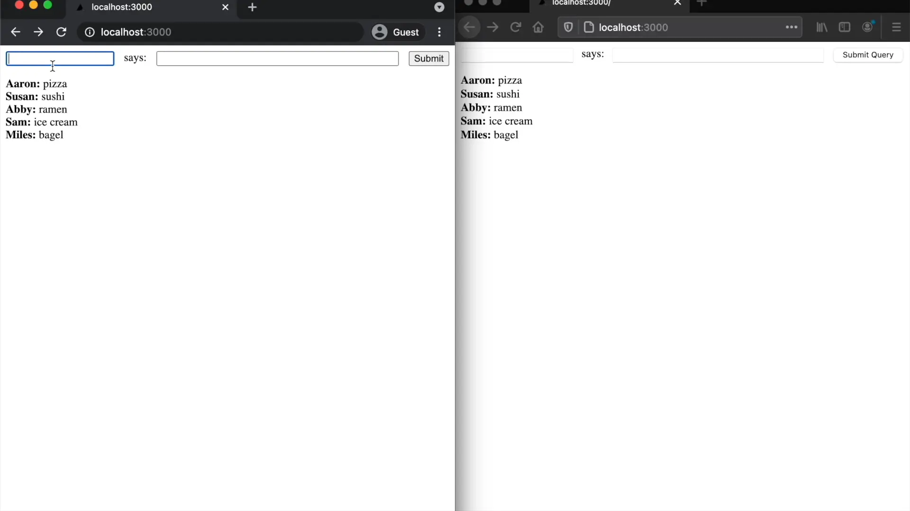
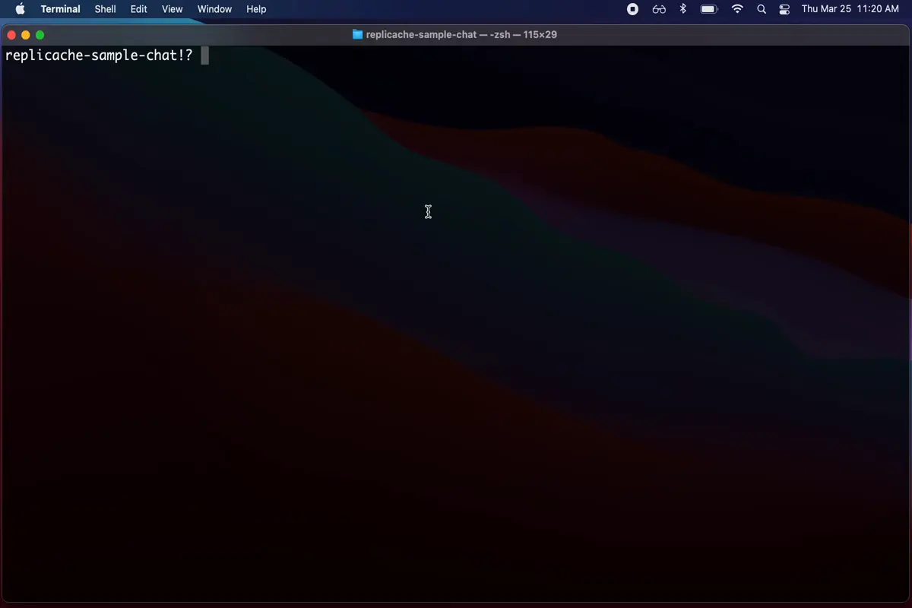
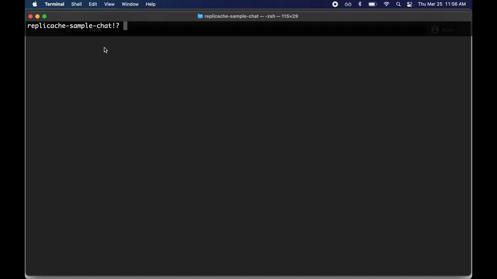
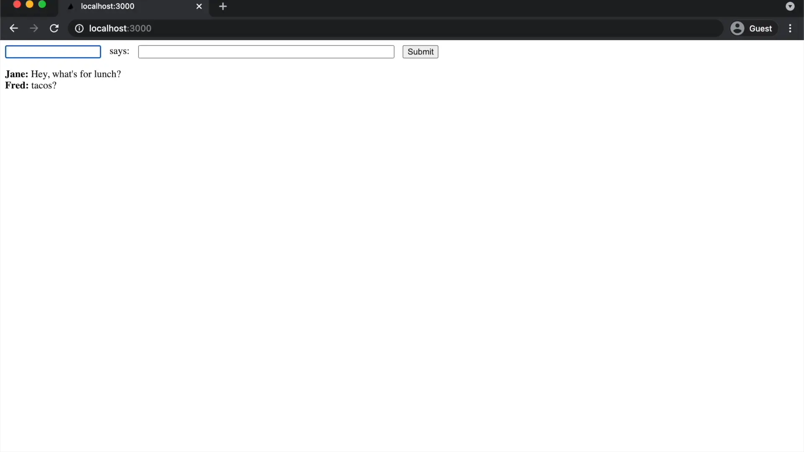
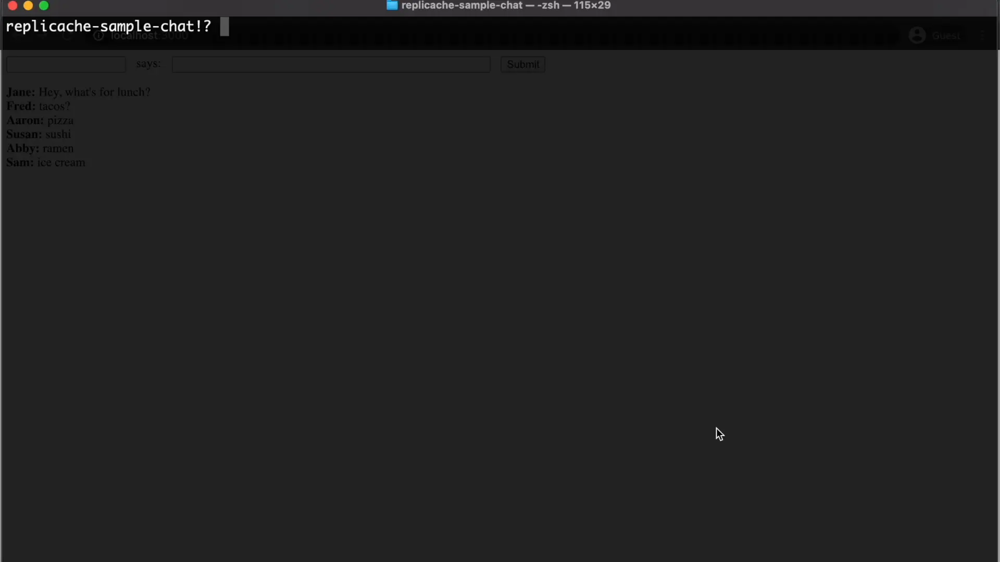
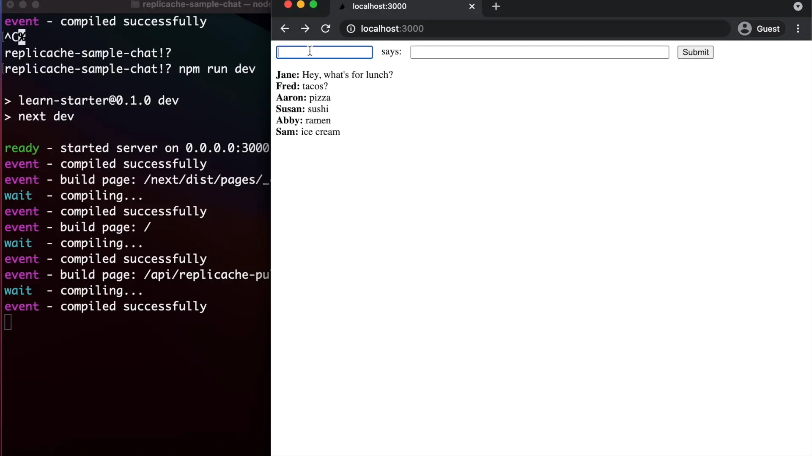
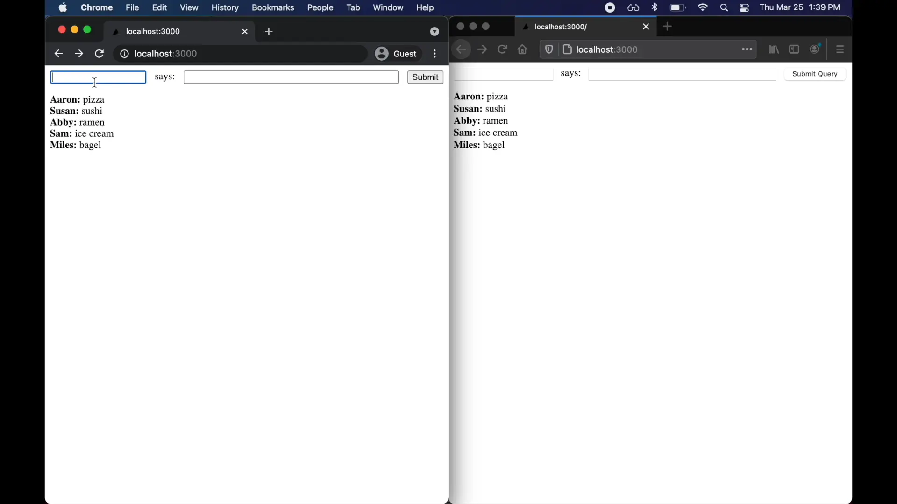

# Replicache Setup

This document walks you through setting up a very simple chat app with Replicache step-by-step.

<p align="center">
  
</p>


You can follow the steps exactly to end up with our chat app, or use them as guide to build your own Replicache-enabled app.

## Architectural Overview

<p align="center">
  
</p>

Replicache is a persistent key/value store that lives inside your web app. Use it as your app's state, in place of things like MobX, Redux, Recoil, Apollo, etc.

You don't need REST or GraphQL APIs when you use Replicache either. Instead, Replicache continuously synchronizes with your server in the background using two special endpoints: `replicache-push` and `replicache-pull`.

To learn more about the big picture of Replicache, see [the design document](./design.md).

We will be building this particular sample app using [Next.js](https://nextjs.org/), [Supabase](https://supabase.io/), and [Pusher.js](https://pusher.com/) because they are great and work nicely with Replicache. But you can use pretty much any frontend and backend stack you want — just apply these steps to your situation, or [contact us](https://replicache.dev/#contact) for help.

## Prerequisites

You only need [Node.js](https://nodejs.org/en/), version 10.13 or higher to get started.

## Step 1: Design Your Client View

The easiest way to start a Replicache project is to design your Client View schema and start serving it. That way, you'll have data to work with when you go to build the UI in the next step.

Since we're trying to build a chat app, a simple list of messages might be a good starting point for our schema:

```json
{
  "messages/D1BCF6A5-F314-4ECA-B03B-EB540A59D5E3": {
    "from": "Jane",
    "order": 1,
    "content": "Hey, what's up for lunch?"
  },
  "messages/1F4E7403-7112-4B5B-9863-62F49F588AAB": {
    "from": "Fred",
    "order": 2,
    "content": "Taaaacos"
  }
}
```

(A real app would likely separate out the user entities, but this is good enough for our purposes.)

**Note:** A quick word on IDs: Unlike with classic client/server apps, Replicache apps can't rely the server to assign unique IDs. That's because the client is going to be working with data long before it reaches the server, and the client and server need a consistent way to refer to items. Therefore, Replicache requires that clients assign IDs. Browsers have [cryptographically strong random sources](https://developer.mozilla.org/en-US/docs/Web/API/Crypto/getRandomValues) now, so there's no real downside to this. If you think this might block your usage of Replicache, [reach out](https://replicache.dev/#contact) — we'd like to learn more.

Now that we know what our schema will look like, let's serve it.

Initially, we'll just serve static data, but later we'll build it dynamically from data in the database.

Create an empty Next.js project:

```bash
npx create-next-app chat  --example "https://github.com/vercel/next-learn-starter/tree/master/learn-starter"
cd chat
```

Create a file in the project at `pages/api/replicache-pull.js` with the following contents:

```js
export default async (req, res) => {
  res.json({
    // We will discuss these two fields in later steps.
    lastMutationID: 0,
    cookie: null,
    patch: [
      {op: 'clear'},
      {
        op: 'put',
        key: 'message/qpdgkvpb9ao',
        value: {
          from: 'Jane',
          content: "Hey, what's for lunch?",
          order: 1,
        },
      },
      {
        op: 'put',
        key: 'message/5ahljadc408',
        value: {
          from: 'Fred',
          content: 'tacos?',
          order: 2,
        },
      },
    ],
  });
  res.end();
};
```

You'll notice the JSON we're serving is a little different than our idealized schema above.

The response from `replicache-pull` is actually a _patch_ — a series of changes that have happened on the server, and need to be applied to the client. Replicache applies them one-by-one, in-order. See [Pull Endpoint](TODO) for more details.

Early in development, it's easiest to just return a patch that replaces the entire state with new values, which is what we've done here. Later in this tutorial we will improve this to return only what has changed.

**Note:** Replicache forks and versions the cache internally, much like Git. You don't have to worry about local pending changes being clobbered by remote changes. Replicache ensures pending changes always supercede remote ones. Also, Replicache is a _transactional_ key/value store. So although the changes are applied one-by-one, they appear to the user (and your application's code) all at once because they're applied within the same transaction.

Start your app with `npm run dev`, and navigate to [http://localhost:3000/api/replicache-pull](http://localhost:3000/api/replicache-pull) to ensure it's working:

<p align="center">
  
</p>

## Step 2: Install Replicache and the React Utils

```bash
npm add replicache replicache-react-util

# Make the Replicache wasm module findable at runtime.
# In a real project, you should do this as part of your postinstall script,
# so that it stays up to date when you upgrade Replicache.
cp node_modules/replicache/out/*.wasm public/
```

## Step 3: Render UI

The next step is to use the data in the Client View to render your UI.

The model is that your UI is a [pure function](https://en.wikipedia.org/wiki/Pure_function) of the data in Replicache. There is no separate in-memory state. Everything\* goes in Replicache.

Whenver the data in Replicache changes — either due to local mutations or syncing with the server — subscriptions will fire, and your UI components re-render. Easy.

**Note:** _Everything??_ Pretty much, yeah. For example, imagine we wanted to support edit of our chat messages like in Slack. In a typical application, you'd keep in-memory state to make that UI responsive while you wait for a server confirmation. In Replicache there is no distinction between the server state and the local in-memory state. You can work with Replicache as if it is in-memory, but changes to it are asynchronously committed to the server behind the scenes.

To create a subscription, use the `useSubscribe()` React hook. You can do multiple reads and compute a result. Your React component only re-renders when the returned result changes.

Let's use a subscription to implement our chat UI. Replace `index.js` with this:

```js
import React, {useEffect, useRef, useState} from 'react';
import {Replicache} from 'replicache';
import {useSubscribe} from 'replicache-react-util';

export default function Home() {
  const [rep, setRep] = useState(null);

  useEffect(async () => {
    const rep = new Replicache({
      pushURL: '/api/replicache-push',
      pullURL: '/api/replicache-pull',
      // The .dev.wasm version is nice during development because it has
      // symbols and additional debugging info. The .wasm version is smaller
      // and faster.
      wasmModule: '/replicache.dev.wasm',
    });
    registerMutators(rep);
    // TODO: https://github.com/rocicorp/replicache/issues/328
    rep.pull();
    listen(rep);
    setRep(rep);
  }, []);

  return rep && <Chat rep={rep} />;
}

function Chat({rep}) {
  const messages = useSubscribe(
    rep,
    async tx => {
      const list = await tx.scanAll({prefix: 'message/'});
      list.sort(([, {order: a}], [, {order: b}]) => a - b);
      return list;
    },
    [],
  );

  const usernameRef = useRef();
  const contentRef = useRef();

  const onSubmit = e => {
    e.preventDefault();
    // TODO: Create message
  };

  return (
    <div style={styles.container}>
      <form style={styles.form} onSubmit={onSubmit}>
        <input ref={usernameRef} style={styles.username} required />
        says:
        <input ref={contentRef} style={styles.content} required />
        <input type="submit" />
      </form>
      <MessageList messages={messages} />
    </div>
  );
}

function MessageList({messages}) {
  return messages.map(([k, v]) => {
    return (
      <div key={k}>
        <b>{v.from}: </b>
        {v.content}
      </div>
    );
  });
}

const styles = {
  container: {
    display: 'flex',
    flexDirection: 'column',
  },
  form: {
    display: 'flex',
    flexDirection: 'row',
    flex: 0,
    marginBottom: '1em',
  },
  username: {
    flex: 0,
    marginRight: '1em',
  },
  content: {
    flex: 1,
    maxWidth: '30em',
    margin: '0 1em',
  },
};

function registerMutators(rep) {
  // TODO: Register mutators
}

function listen(rep) {
  // TODO: Listen for changes on server
}
```

Then restart your server and navigate to [http://localhost:3000/](http://localhost:3000). You should see that we're rendering data from Replicache!

<p align="center">
  
</p>

This might not seem that exciting yet, but notice that if you change `replicache-pull` temporarily to return 500 (or remove it, or cause any other error, or just make it really slow), the page still renders instantly.

That's because we're rendering the data from local storage on startup, not waiting for the server! Woo.

## Step 4: Local Mutations

Next up: Local mutations. Because read-only apps are not all that useful.

With Replicache, you implement mutations once on the client-side (sometimes called _speculative_ or _optimistic_ mutations), and then again on the server (called _authoritative_ mutations).

_Note:_ The two implementations need not match exactly. Replicache replaces the result of a speculative change completely with the result of the corresponding authoritative change, once it's known. This is useful because it means the speculative implementation can frequently be pretty simple, not taking into account security, complex business logic edge cases, etc. Also, if you happen to be running JavaScript on the server, you can of course share mutation code extensively between client and server.

First, let's register a _mutator_ that speculatively creates a message. In `index.js`, replace the `registerMutators` function with:

```js
function registerMutators(rep) {
  // TODO: https://github.com/rocicorp/replicache/issues/329
  rep.createMessage = rep.register(
    'createMessage',
    (tx, {id, from, content, order}) => {
      tx.put(`message/${id}`, {
        from,
        content,
        order,
      });
    },
  );
}
```

Now let's invoke the mutator when the user types a message. Replace the content of `onSubmit` so that it invokes the mutator:

```js
const onSubmit = e => {
  e.preventDefault();
  const last = messages.length && messages[messages.length - 1][1];
  const order = (last?.order ?? 0) + 1;
  rep.createMessage({
    // Easy unique ID. In a real app use a GUID.
    id: Math.random().toString(32).substr(2),
    from: usernameRef.current.value,
    content: contentRef.current.value,
    order,
  });
  usernameRef.current.value = '';
  contentRef.current.value = '';
};
```

It's important to remember that Replicache will frequently re-run mutations during sync against different versions of the cache. Thus a mutator's behavior should not depend on anything other than its parameters and the cache itself (it should be a pure function of its parameters, including `tx`).

For example here, we pass the generated unique ID _into_ the mutator as a param, rather than creating it inside the implementation. This may be counter-intuitive at first, but it make sense when you remember that Replicache is going to replay this transaction during sync, and we don't want the ID to change!

_Note:_ Careful readers may be wondering what happens with the order field during sync. Can multiple messages end up with the same order? Yes! But in this case, what the user likely wants is for their message to stay rougly at the same position in the stream, and using the client-specified order and sorting by that roughly achieves the desired result. If we wanted better control over this, we could use [fractional indexing](https://www.npmjs.com/package/fractional-indexing) but that's not necessary in this case.

Restart the server and you should now be able to make changes!

<p align="center">
  
</p>

Notice that even though we're not saving anything to the server yet, the mutations are saved locally across sessions, and it even works across tabs. Whee!

## Step 5: Remote Database Setup

Replicache automatically batches mutations and sends them to the `replicache-push` endpoint periodically. Implementing the push handler is not much different than implementing a REST or GraphQL endpoint, with one key difference.

Each mutation is identified with a `mutationID` which is a per-client incrementing integer. The server must store this value transactionally when applying the mutation, and return it later in `replicache-pull`. This is what allows Replicache to know when speculative mutations can be discarded.

For this demo, we're using [Supabase](https://supabase.io), a very nice hosted Postgres database with a snazzy name. But you can use any datastore as long as it can transactionally update the `lastMutationID`. See [Backend Requirements](TODO) for precise details of what your backend needs to support Replicache.

Head over to [Supabase](https://supabase.io) and create a free account and an empty database. Then add Supabase's Postgres connection string to your environment. You can get it from your Supabase project by clicking on ⚙️ (Gear/Cog) > Database > Connection String.

```bash
export REPLICHAT_DB_CONNECTION_STRING=<your connnection string>
```

Then, install the Postgres client library:

```bash
npm install pg-promise
```

Create a new file `db.js` with this code:

```js
import pgInit from 'pg-promise';

export async function getDB() {
  const pgp = pgInit();
  const db = pgp({
    connectionString: process.env.REPLICHAT_DB_CONNECTION_STRING,
  });
  await db.connect();
  return db;
}
```

And another new file `pages/api/init.js` that initializes the schema:

```js
import {getDB} from '../../db.js';

export default async (_, res) => {
  const db = await getDB();
  await db.task(async t => {
    await t.none('DROP TABLE IF EXISTS message');
    await t.none('DROP TABLE IF EXISTS replicache_client');
    await t.none('DROP SEQUENCE IF EXISTS version');
    // Stores chat messages
    await t.none(`CREATE TABLE message (
      id VARCHAR(20) PRIMARY KEY NOT NULL,
      sender VARCHAR(255) NOT NULL,
      content TEXT NOT NULL,
      ord BIGINT NOT NULL,
      version BIGINT NOT NULL)`);
    // Stores last mutation ID for each Replicache client
    await t.none(`CREATE TABLE replicache_client (
      id VARCHAR(36) PRIMARY KEY NOT NULL,
      last_mutation_id BIGINT NOT NULL)`);
    // Will be used for computing diffs for pull response
    await t.none('CREATE SEQUENCE version');
  });
  res.send('ok');
};
```

Start up your server again and navigate to [http://localhost:3000/api/init](http://localhost:3000/api/init). You should see the text "OK" after a few moments. Then if you go to your Supabase UI, you should see the new tables.

<p align="center">
  
</p>

## Step 6: Remote Mutations

Now to actually implement our push handler. Create a new file `pages/api/replicache-push.js` and copy the following code into it:

```js
import {getDB} from '../../db';

export default async (req, res) => {
  const push = req.body;
  console.log('Processing push', JSON.stringify(push, null, ''));

  const t0 = Date.now();
  try {
    const db = await getDB();
    await db.tx(async t => {
      const {nextval: version} = await db.one("SELECT nextval('version')");
      let lastMutationID = parseInt(
        (
          await db.oneOrNone(
            'SELECT last_mutation_id FROM replicache_client WHERE id = $1',
            push.clientID,
          )
        )?.last_mutation_id ?? '0',
      );

      if (!lastMutationID) {
        await db.none(
          'INSERT INTO replicache_client (id, last_mutation_id) VALUES ($1, $2)',
          [push.clientID, lastMutationID],
        );
      }
      console.log('version', version, 'lastMutationID:', lastMutationID);

      for (let i = 0; i < push.mutations.length; i++) {
        const t1 = Date.now();

        const mutation = push.mutations[i];
        const expectedMutationID = lastMutationID + 1;

        if (mutation.id < expectedMutationID) {
          console.log(
            `Mutation ${mutation.id} has already been processed - skipping`,
          );
          continue;
        }
        if (mutation.id > expectedMutationID) {
          console.warn(`Mutation ${mutation.id} is from the future - aborting`);
          break;
        }

        console.log('Processing mutation:', JSON.stringify(mutation, null, ''));

        switch (mutation.name) {
          case 'createMessage':
            await createMessage(db, mutation.args, version);
            break;
          default:
            throw new Error(`Unknown mutation: ${mutation.name}`);
        }

        lastMutationID = expectedMutationID;
        console.log('Processed mutation in', Date.now() - t1);
      }

      await sendPoke();

      console.log(
        'setting',
        push.clientID,
        'last_mutation_id to',
        lastMutationID,
      );
      await db.none(
        'UPDATE replicache_client SET last_mutation_id = $2 WHERE id = $1',
        [push.clientID, lastMutationID],
      );
      res.send('ok');
    });
  } catch (e) {
    console.error(e);
    res.status(500).send(e.toString());
  } finally {
    console.log('Processed push in', Date.now() - t0);
  }
};

async function createMessage(db, {id, from, content, order}, version) {
  await db.none(
    `INSERT INTO message (
    id, sender, content, ord, version) values 
    ($1, $2, $3, $4, $5)`,
    [id, from, content, order, version],
  );
}

async function sendPoke() {
  // TODO
}
```

See [Push Endpoint Reference](TODO) for complete details on implementing the push endpoint.

_Note:_ In the code sample above, we updated a special `version` column in the message table which will be used in combination with Replicache's _cookie_ support to compute delta responses for `replicache-pull` in the next step. This is an easy way to do it and works for many apps. See [Cookie Monster Manual](TODO) for other options.

Restart the server, navigate to [http://localhost:3000/](http://localhost:3000/) and make some changes. You should now see changes getting saved in Supabase. Niiiice.

<p align="center">
  
</p>

But we don't see the change propagating to other browsers yet. What gives?

## Step 7: Make Pull Dynamic

Even though in the previous step we're making persistent changes in the remote database, we still aren't _serving_ that data in the pull endpoint (it's still static 🤣).

The reason we don't see the changes disappearing from the source browser is because Replicache is doing its job and holding onto speculative changes until they are confirmed by the server!

Let's fix that now. We'll also use the `cookie` field to return only changed messages.

Replace the contents of `pages/api/replicache-pull.js` with this code:

```js
import {getDB} from '../../db';

export default async (req, res) => {
  const pull = req.body;
  console.log(`Processing pull`, JSON.stringify(pull, null, ''));
  const t0 = Date.now();

  try {
    const db = await getDB();
    db.tx(async t => {
      const lastMutationID = parseInt(
        (
          await db.oneOrNone(
            'select last_mutation_id from replicache_client where id = $1',
            pull.clientID,
          )
        )?.last_mutation_id ?? '0',
      );
      const changed = await db.manyOrNone(
        'select id, sender, content, ord from message where version > $1',
        parseInt(pull.cookie ?? 0),
      );
      const cookie = (
        await db.one('select max(version) as version from message')
      ).version;
      console.log({cookie, lastMutationID, changed});

      res.json({
        lastMutationID,
        cookie,
        patch: changed.map(row => ({
          op: 'put',
          key: `message/${row.id}`,
          value: {
            from: row.sender,
            content: row.content,
            order: row.ord,
          },
        })),
      });
      res.end();
    });
  } catch (e) {
    console.error(e);
    res.status(500).send(e.toString());
  }
};
```

Voila. We're now round-tripping browsers and devices!

<p align="center">
  
</p>

Also notice that if we go offline for awhile, make some changes, then come back online, the mutations get sent when possible.

We don't have any conflicts in this simple data model, but Replicache makes it easy to reason about most conflicts. See the [Design Doc](TODO) for more details.

The only thing left is to make it live — we obviously don't want the user to have to manually refresh to get new data 🙄.

## Step 8: Poke

Many realtime systems use WebSockets to push live updates to clients. This has performance benefits, but comes at a steep operational cost. WebSocket-based services are much more complex to scale because they have to keep state in memory for each connected client.

Replicache instead uses WebSockets only to hint the client that it should pull again. No data is sent over the socket. This enables developers to build their realtime web applications in the standard stateless request/response style. You can even build Replicache-enabled apps serverlessly (as we are here with Next.js)! We have found that we can get most of the performace back with HTTP/2, anyway.

We refer to this WebSocket hint as a _poke_, to go along with _push_ and _pull_. You can use any hosted WebSocket service to send pokes, such as [socket.io](https://socket.io) or [Pusher](https://pusher.com/), and it's trivial to setup.

For this sample, we'll use Pusher. Get thee to [pusher.com](https://pusher.com) and setup a free project with client type "React" and server type "Node.js".

Store the settings from the project in the following environment variables:

```bash
export NEXT_PUBLIC_REPLICHAT_PUSHER_APP_ID=<app id>
export NEXT_PUBLIC_REPLICHAT_PUSHER_KEY=<key>
export NEXT_PUBLIC_REPLICHAT_PUSHER_SECRET=<secret>
export NEXT_PUBLIC_REPLICHAT_PUSHER_CLUSTER=<cluster>
```

Then install the client and server Pusher libs:

```js
npm install pusher pusher-js
```

Import the library into `pages/api/replicache-push.js`:

```js
import Pusher from 'pusher';
```

Typically you'll establish one WebSocket _channel_ per-document or whatever the unit of collaobration is in your application. For this simple demo, we just create one channel, `"default"`.

Replace the implementation of `sendPoke()` in `replicache-push.js`:

```js
async function sendPoke() {
  const pusher = new Pusher({
    appId: process.env.NEXT_PUBLIC_REPLICHAT_PUSHER_APP_ID,
    key: process.env.NEXT_PUBLIC_REPLICHAT_PUSHER_KEY,
    secret: process.env.NEXT_PUBLIC_REPLICHAT_PUSHER_SECRET,
    cluster: process.env.NEXT_PUBLIC_REPLICHAT_PUSHER_CLUSTER,
    useTLS: true,
  });
  const t0 = Date.now();
  await pusher.trigger('default', 'poke', {});
  console.log('Sent poke in', Date.now() - t0);
}
```

Then on the client, in `index.js`, import the client library:

```js
import Pusher from 'pusher-js';
```

... and replace the implementation of `listen()` to tell Replicache to `pull()` whenever a poke is received:

```js
function listen(rep) {
  console.log('listening');
  // Listen for pokes, and pull whenever we get one.
  Pusher.logToConsole = true;
  const pusher = new Pusher(process.env.NEXT_PUBLIC_REPLICHAT_PUSHER_KEY, {
    cluster: process.env.NEXT_PUBLIC_REPLICHAT_PUSHER_CLUSTER,
  });
  const channel = pusher.subscribe('default');
  channel.bind('poke', () => {
    console.log('got poked');
    rep.pull();
  });
}
```

Restart the app, and make a change, and you should see it propagate live between browsers:

<p align="center">
  
</p>

## Conclusion

And that's it!

We've setup a simple realtime offline-enabled chat application against a vanilla serverless/Postgres stack with the help of Replicache.

It's a little bit more work than an all-in-one system like Firebase, but you can implement it directly against your own stack without reliance on a giant third-party system.

This particular application is trivial, but the techniques generalize to much more complex systems. For example, see [Replidraw](https://replidraw.vercel.app) our realtime collaborative graphics editor.
